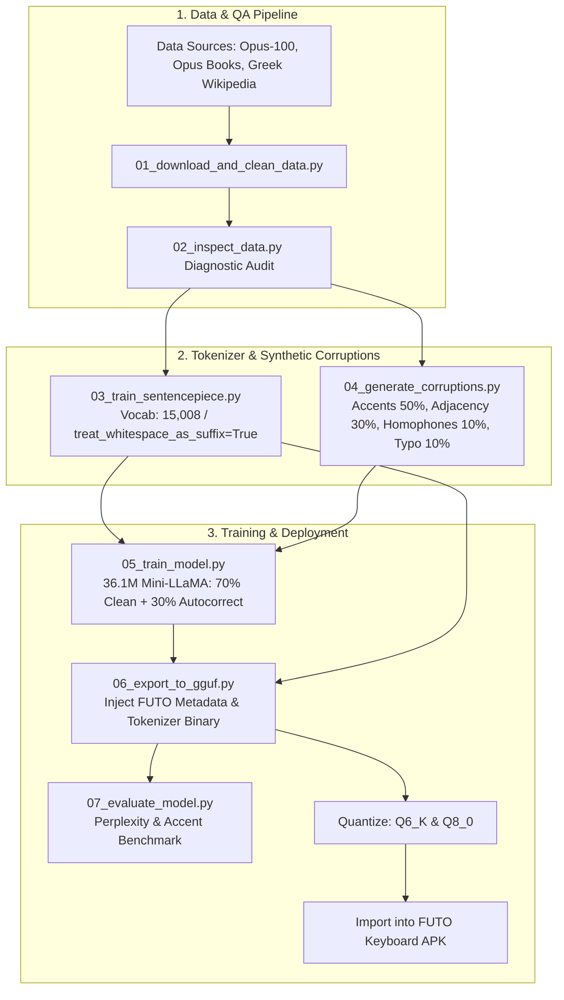

# Greek Transformer Language Model for FUTO Keyboard

Custom Modern Greek (`el`) predictive text and autocorrect Transformer Language Model (~36.1M parameters) built for the **FUTO Android Keyboard**.

---

## 1. Overview & Architecture

This repository contains the complete end-to-end Python pipeline to gather datasets, train a SentencePiece tokenizer, train a compact LLaMA causal language model matching FUTO's official 36M specification, inject FUTO custom metadata, and export/quantize GGUF models for mobile on-device inference.



### Model Specifications

| Parameter | Value | Description / Rationale |
| :--- | :--- | :--- |
| **Model Family** | `LlamaForCausalLM` | Supported by FUTO's embedded GGML runtime |
| **Total Parameters** | $\approx 36.15\text{M}$ | Matches official FUTO Keyboard standard model profile |
| **Hidden Size ($d_{\text{model}}$)** | `512` | Standard FUTO mini-LLaMA dimension |
| **Hidden Layers** | `9` | Optimized balance between capacity and latency |
| **Attention Heads** | `8` | Head dimension of 64 |
| **Intermediate Size** | `1376` | SwiGLU projection |
| **Tied Word Embeddings** | `True` | Weight-sharing between input embedding and lm_head |
| **Max Context Window** | `256` tokens | Fits keyboard fast-forward context buffer |
| **Tokenizer** | SentencePiece (Unigram) | Required by FUTO runtime |
| **Tokenizer Flags** | `treat_whitespace_as_suffix=True` | **Mandatory** for keystroke prefix matching |
| **Vocabulary Size** | `15,008` tokens | Compact embedding table (~8MB) and fast softmax |
| **Control Tokens** | `<XBU>`, `<XBC>`, `<XEC>` | Autocorrect protocol: `[Ctx] <XBU>error<XBC>target<XEC>` |
| **Quantization** | `Q6_K` (~36.8MB) & `Q8_0` (~45.4MB) | Memory-efficient for mobile RAM |

---

## 2. Repository Structure

```text
greek-keyboard-lm/
├── 01_download_and_clean_data.py   # 1. Dataset streaming, cleaning, and QA splitting
├── 02_inspect_data.py              # 2. Diagnostic audit & monotonic accent compliance
├── 03_train_sentencepiece.py       # 3. SentencePiece Unigram trainer (whole-word seeded, 15,008 vocab)
├── 04_generate_corruptions.py      # 4. Synthetic Greek typo & iotacism corruption engine
├── 05_train_model.py               # 5. ~36.15M parameter mini-LLaMA PyTorch trainer
├── 06_export_to_gguf.py            # 6. GGUF exporter with embedded FUTO metadata & output.weight
├── 07_evaluate_model.py            # 7. Benchmarks (PPL, Top-k, Accents) & Interactive REPL
├── check_gguf.py                   # GGUF & FUTO KeyboardLM metadata inspector
├── demo.py                         # Interactive CLI mobile keyboard suggestion bar simulator
├── run_training.sh                 # Unified orchestration script (Train -> Export -> Quantize -> Evaluate)
├── models.json                     # FUTO Keyboard catalog manifest
├── requirements.txt                # Python dependencies
└── README.md                       # Documentation
```

---

## 3. Installation & Setup

Ensure you are using Python 3.10+:

```bash
# 1. Clone repository
git clone https://github.com/stamchry/greek-keyboard-lm.git
cd greek-keyboard-lm

# 2. Create and activate virtual environment
python3 -m venv .venv
source .venv/bin/activate

# 3. Install dependencies
pip install -r requirements.txt
```

---

## 4. Pipeline Execution Guide

### Step 1: Download and Clean Greek Datasets
Ingests Opus-100 dialogues, Opus Books literature, and Greek Wikipedia. Strips subtitle timing cues, hearing-impaired tags, speaker markers, HTML, boilerplate, applies $\ge 85\%$ Greek character ratio filtering, normalizes Greek Unicode lookalikes (`ß` $\to$ `β`, `µ` $\to$ `μ`), and deduplicates lines.

```bash
python3 01_download_and_clean_data.py \
    --output_dir data/processed \
    --max_conv 500000 \
    --max_lit 100000 \
    --max_wiki 200000
```

Outputs:
- `data/processed/train.txt` (666,012 lines)
- `data/processed/val.txt` (17,526 lines)
- `data/processed/test.txt` (17,526 lines)
- `data/processed/dataset_stats.json`

---

### Step 2: Quality Assurance & Accent Audit
Audits token distributions, character ratios, monotonic accent compliance on polysyllabic words, and generates a structured Markdown report.

```bash
python3 02_inspect_data.py \
    --input_file data/processed/train.txt \
    --report_file data/qa_report.md
```

---

### Step 3: Train SentencePiece Tokenizer
Trains a 15,008 vocabulary Unigram tokenizer with `treat_whitespace_as_suffix=True`, `byte_fallback=True`, whole-word frequency seeding (guaranteeing >70% whole words and eliminating dangling suffix fragments like `[εύς]`, `[ούπολη]`), and FUTO control tokens (`<XBU>`, `<XBC>`, `<XEC>`).

```bash
python3 03_train_sentencepiece.py \
    --input_file data/processed/train.txt \
    --output_dir models/tokenizer \
    --vocab_size 15008
```

---

### Step 4: Generate Synthetic Autocorrect Benchmarks
Generates synthetic Greek typing errors for test evaluation:
- 50% Accent stripping (e.g. `καλημερα` $\to$ `καλημέρα`)
- 30% Greek QWERTY adjacency (e.g. `α` $\leftrightarrow$ `σ`, `φ` $\leftrightarrow$ `γ`, `θ` $\leftrightarrow$ `ι`)
- 10% Homophones / Iotacism (e.g. `/i/`: `ι` $\leftrightarrow$ `η` $\leftrightarrow$ `υ` $\leftrightarrow$ `ει` $\leftrightarrow$ `οι`, `/e/`: `ε` $\leftrightarrow$ `αι`)
- 10% Typo dynamics (transpositions, deletions, insertions)

```bash
python3 04_generate_corruptions.py \
    --input_file data/processed/test.txt \
    --output_file data/autocorrect_eval.jsonl \
    --num_samples 1000
```

---

### Step 5: Train ~36M LLaMA Model
Trains the custom 36.1M parameter LLaMA model using PyTorch with `bfloat16` mixed precision, dynamically mixing 50% clean next-token sequences and 50% autocorrect prompts with AdamW and cosine decay.

```bash
python3 05_train_model.py \
    --train_file data/processed/train.txt \
    --val_file data/processed/val.txt \
    --tokenizer_dir models/tokenizer \
    --output_dir models/checkpoints \
    --autocorrect_ratio 0.50 \
    --epochs 5 \
    --batch_size 32 \
    --grad_accum 2 \
    --lr 3e-4
```

---

### Step 6: Export to GGUF & Inject FUTO Metadata
Converts trained PyTorch weights to GGUF format, explicitly duplicates `token_embd.weight` as `output.weight` (mandated by FUTO's embedded GGML runtime), and embeds the raw SentencePiece binary and required FUTO metadata:

```bash
python3 06_export_to_gguf.py \
    --model_dir models/checkpoints/best_model \
    --tokenizer_file models/tokenizer/tokenizer.model \
    --output_file models/gguf/el_keyboard_f16.gguf \
    --quantize
```

Injected FUTO Metadata Keys:
```python
keyboardlm.languages = "el"
keyboardlm.features = "base_v1 inverted_space lora_finetunable_v1"
keyboardlm.ext_tokenizer_type = "sentencepiece"
keyboardlm.ext_tokenizer_data = <raw tokenizer.model UINT8 binary bytes>
keyboardlm.finetuning_count = 0
keyboardlm.history = ""
```

---

### Step 7: Inspect & Evaluate Model Performance

#### 1. Inspect GGUF Metadata Compliance:
```bash
python3 check_gguf.py models/gguf/el_keyboard_Q6_K.gguf
```

#### 2. Automated Evaluation Benchmark:
```bash
python3 07_evaluate_model.py \
    --model_dir models/checkpoints/best_model \
    --tokenizer_file models/tokenizer/tokenizer.model \
    --test_file data/processed/test.txt \
    --eval_jsonl data/autocorrect_eval.jsonl
```

#### 3. Interactive CLI Keyboard Simulator:
```bash
python3 demo.py
```

---

## 5. Mobile Deployment to FUTO Keyboard

1. **Transfer Model**: Copy `models/gguf/el_keyboard_Q6_K.gguf` (~36MB) to your Android device storage.
2. **Unlock Developer Mode**:
   - Open **FUTO Keyboard Settings → Help & About**.
   - Tap **"Version code" 8 times rapidly** to unlock Developer Settings.
3. **Enable Non-QWERTY Layout Support**:
   - Open **Settings → Developer** $\to$ toggle **"Allow transformer models on non QWERTY layouts"** to **ON**.
4. **Import & Set Default**:
   - Go to **Settings → Predictive Text → Transformer Models**.
   - Tap **Actions (top-right) → Import from file** $\to$ select `el_keyboard_Q6_K.gguf`.
   - Tap the imported model and ensure it displays: **"Model is set to default for el"**.
5. **Verify in Chat**:
   - Switch to Greek keyboard layout.
   - A small horizontal indicator line appears under transformer suggestions in the top suggestion strip.

---

## 6. License

Apache-2.0 License.
