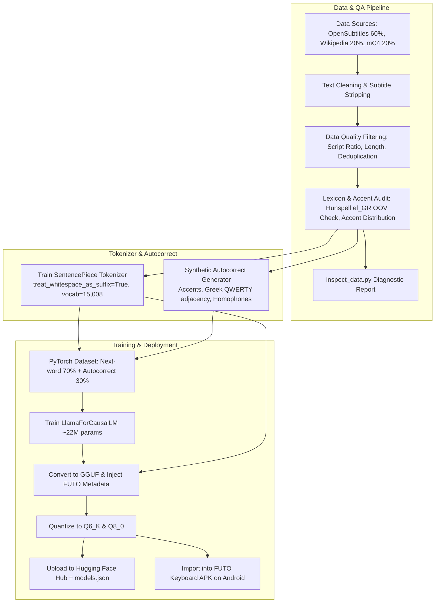

# Implementation Plan: Greek Transformer Language Model for FUTO Keyboard

This document outlines the complete step-by-step engineering plan to create, train, package, and deploy a custom **Greek Transformer Language Model (KeyboardLM)** for the FUTO Android Keyboard.

---

## 1. Architecture & Ecosystem Overview

The project is structured as a dedicated, standalone repository (`greek-keyboard-lm`) containing the dataset pipeline, tokenizer trainer, model training scripts, and GGUF exporter.



---

## 2. Technical Specifications

| Parameter | Value | Rationale |
| :--- | :--- | :--- |
| **Repository Structure** | Standalone Git repo + Hugging Face Hub | Isolates Python/PyTorch dependencies from Android Gradle codebase |
| **Model Family** | `LlamaForCausalLM` | Directly supported by FUTO’s embedded GGML runtime |
| **Parameter Count** | $\approx 22\text{M} - 25\text{M}$ | Sub-20ms real-time latency on mobile CPUs |
| **Hidden Size ($d_{\text{model}}$)** | `512` | Standard FUTO mini-LLaMA dimension |
| **Hidden Layers** | `10` | Balances capacity and mobile battery consumption |
| **Attention Heads** | `8` | Head dimension of 64 |
| **Intermediate Size** | `1376` | SwiGLU projection |
| **Max Context Window** | `256` tokens | Fits keyboard fast-forward context buffer |
| **Tokenizer** | SentencePiece (Unigram) | Required by FUTO runtime |
| **Tokenizer Flags** | `treat_whitespace_as_suffix=True` | **Mandatory** for keyboard word completion |
| **Vocabulary Size** | `15,008` tokens | Compact embedding table (~8MB) and fast softmax |
| **Control Tokens** | `<XBU>`, `<XBC>`, `<XEC>` | Autocorrect composition protocol |
| **Quantization** | `Q6_K` (~20MB) & `Q8_0` (~26MB) | Memory-efficient for mobile RAM |

---

## 3. Data Gathering & Quality Assurance Strategy

### A. Data Blend
* **Conversational / Spoken (~60%)**:
  * **OpenSubtitles Greek (`open_subtitles` `el`)**: Natural dialogue, turn-taking, common idioms.
  * **Tatoeba Greek (`tatoeba` `el`)**: Short, clean colloquial sentences.
* **Formal / Informational (~40%)**:
  * **Greek Wikipedia (`wikimedia/wikipedia` `20231101.el`)**: Encyclopedic vocabulary and grammar.
  * **mC4 / C4 Greek (`allenai/c4` / `mc4` `el`)**: Cleaned web articles and modern written Greek.

### B. Quality Filtering & Validation Rules
1. **Greek Character Ratio**:
   * Minimum $\ge 85\%$ of all alphabetic characters must fall in the Greek Unicode block (`\u0370-\u03FF` and `\u1F00-\u1FFF`). Discard lines with high Latin ratio or mixed junk.
2. **Subtitle & Web Artifact Removal**:
   * Strip timing cues, hearing-impaired tags (`[ΜΟΥΣΙΚΗ]`, `(ΓΕΛΙΑ)`), speaker markers (`- ΝΙΚΟΣ:`), and subtitle group headers (`Υπότιτλοι:`).
   * Strip HTML tags, URLs, cookie disclaimers, and boilerplate navigation headers.
3. **Length & Structure Constraints**:
   * Keep only lines between 3 and 40 words.
4. **Deduplication**:
   * Exact hash deduplication to eliminate repeated subtitles and boilerplate.
5. **Lexicon & Accent Audit**:
   * Validate against a canonical Greek lexicon (e.g. Hunspell `el_GR`). Filter out documents where OOV rate exceeds $20\%$.
   * Audit accent distribution: verify that polysyllabic words have monotonic accents (`ά, έ, ή, ί, ό, ύ, ώ`). Completely unaccented web scrapes are filtered out from the clean training set.
6. **Diagnostic Tool (`inspect_data.py`)**:
   * Samples stratified batches across sources and produces a quality report (vocabulary statistics, character distributions, outlier samples).

---

## 4. Synthetic Autocorrect & Accent Restoration

Format: `[Context] <XBU>[corrupted_word]<XBC>[target_word]<XEC>`

1. **Accent / Tonos Stripping (50% of corruptions)**:
   * Essential for mobile typing: users type `καλημερα` expecting `καλημέρα` (e.g., `ειμαι` $\to$ `είμαι`, `θελω` $\to$ `θέλω`).
2. **Greek QWERTY Layout Adjacency (30% of corruptions)**:
   * Substitutions based on Euclidean distance on Greek keyboard:
     `α` $\leftrightarrow$ `σ`, `φ` $\leftrightarrow$ `γ`, `θ` $\leftrightarrow$ `ι`, `κ` $\leftrightarrow$ `λ`, `ω` $\leftrightarrow$ `β`, `π` $\leftrightarrow$ `ο`.
3. **Greek Homophone / Iotacism Confusions (10% of corruptions)**:
   * `/i/`: `ι` $\leftrightarrow$ `η` $\leftrightarrow$ `υ` $\leftrightarrow$ `ει` $\leftrightarrow$ `οι`
   * `/e/`: `ε` $\leftrightarrow$ `αι`
   * `/o/`: `ο` $\leftrightarrow$ `ω`
4. **Typo Dynamics (10%)**:
   * Transposition (e.g. `κλαημέρα`), single-character insertions, deletions.

---

## 5. Model Training & Export

### A. Training Setup (`04_train_model.py`)
* Model: `LlamaForCausalLM` with `LlamaConfig(vocab_size=15008, hidden_size=512, num_hidden_layers=10, num_attention_heads=8, intermediate_size=1376, max_position_embeddings=256)`.
* Batch mix: 70% clean next-word prediction + 30% synthetic autocorrect sequences.
* Optimization: AdamW ($\text{lr} = 3\text{e-}4$, linear warmup, cosine decay), mixed precision (`bf16`/`fp16`).

### B. GGUF Conversion & Metadata Injection (`05_export_to_gguf.py`)
* Converts PyTorch checkpoints to GGUF.
* Embeds raw `tokenizer.model` binary into `keyboardlm.ext_tokenizer_data`.
* Injects FUTO metadata:
  ```python
  gguf_writer.add_string("general.name", "Greek Keyboard LM")
  gguf_writer.add_string("general.author", "Community")
  gguf_writer.add_string("general.description", "Modern Greek Transformer LM for FUTO Keyboard")
  gguf_writer.add_string("general.license", "Apache-2.0")
  gguf_writer.add_string("keyboardlm.languages", "el")
  gguf_writer.add_string("keyboardlm.features", "base_v1 inverted_space xbu_char_autocorrect_v1 lora_finetunable_v1")
  gguf_writer.add_string("keyboardlm.ext_tokenizer_type", "sentencepiece")
  gguf_writer.add_array("keyboardlm.ext_tokenizer_data", tokenizer_bytes)
  gguf_writer.add_uint32("keyboardlm.finetuning_count", 0)
  gguf_writer.add_string("keyboardlm.history", "")
  ```
* Quantize using `llama-quantize` to `Q6_K` and `Q8_0`.

---

## 6. Standalone Project Layout

```
greek-keyboard-lm/
├── README.md                       # Documentation, architecture, and step-by-step usage guide
├── requirements.txt                # Dependencies (torch, transformers, datasets, sentencepiece, gguf)
├── 01_download_and_clean_data.py   # Ingests Wikipedia, OpenSubtitles, mC4 Greek and runs QA filters
├── 02_inspect_data.py              # Diagnostic script to audit dataset quality, accents, and OOV rates
├── 03_train_sentencepiece.py       # Trains SentencePiece tokenizer with treat_whitespace_as_suffix=True
├── 04_generate_corruptions.py      # Generates synthetic Greek typos, unaccented pairs, & layout errors
├── 05_train_model.py               # Configures and trains 22M LlamaForCausalLM model with PyTorch
├── 06_export_to_gguf.py            # Converts PyTorch model to GGUF and injects keyboardlm metadata
├── 07_evaluate_model.py            # Evaluates next-word perplexity, top-k accuracy, and autocorrect
└── models.json                     # Hugging Face manifest for FUTO Keyboard online catalog integration
```

---

## 7. Verification & Deployment

1. **Automated Evaluation**:
   * Perplexity on validation split.
   * $>95\%$ accuracy on accent restoration test set (1,000 unaccented words).
   * GGUF metadata schema validation against `ModelMeta.cpp`.
2. **Device Deployment**:
   * Transfer `el_keyboard_Q6_K.gguf` to device.
   * In FUTO Keyboard: **Settings → Predictive Text → Transformer Models → Actions → Import from file**.
   * Select `el_keyboard_Q6_K.gguf` and verify live predictions and autocorrect on Greek keyboard.
